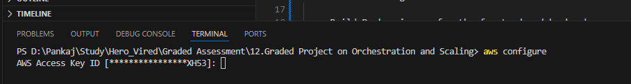
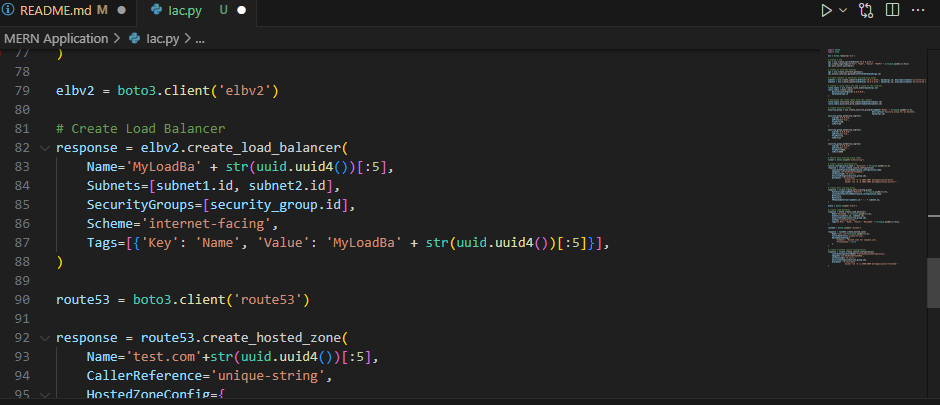

# MERN Application Deplyment
## Step 1: Set Up the AWS Environment

- Set Up AWS CLI and Boto3:

   - Install AWS CLI and configure it with AWS credentials.
     
   - Install Boto3 for Python and configure it.
     

## Step 2: Prepare the MERN Application

- Containerize the MERN Application:

   - Ensure the MERN application is containerized using Docker. Create a Dockerfile for each component (frontend and backend).
   
   

- Push Docker ReadME_Images/images to Amazon ECR:

   - Build Docker ReadME_Images/images for the frontend and backend.
     

   - Create an Amazon ECR repository for each ReadME_Images/image.
      

   - Push the Docker ReadME_Images/images to their respective ECR repositories.
     
     
     

## Step 3: Version Control

- Use AWS CodeCommit:

   - Create a CodeCommit repository.
      
   - Push the MERN application source code to the CodeCommit repository.
     

## Step 4: Continuous Integration with Jenkins

- Set Up Jenkins:

   - Install Jenkins on an EC2 instance.
   - Configure Jenkins with necessary plugins.
     

- Create Jenkins Jobs:

   - Create Jenkins jobs for building and pushing Docker ReadME_Images/images to ECR.

   - Trigger the Jenkins jobs whenever there's a new commit in the CodeCommit repository.

   
   
   
   
   

## Step 5: Infrastructure as Code (IaC) with Boto3

- Define Infrastructure with Boto3 (Python Script):

   - Use Boto3 to define the infrastructure (VPC, subnets, security groups).
   - Define an Auto Scaling Group (ASG) for the backend.
   - Create AWS Lambda functions
   
   

## Step 6: Deploying Backend Services

- Deploy Backend on EC2 with ASG:

   - Use Boto3 to deploy EC2 instances with the Dockerized backend application in the ASG.
   

## Step 7: Set Up Networking

- Create Load Balancer:

   - Set up an Elastic Load Balancer (ELB) for the backend ASG.

- Configure DNS:

   - Set up DNS using Route 53 or any other DNS service.

   

## Step 8: Deploying Frontend Services

- Deploy Frontend on EC2:

   - Use Boto3 to deploy EC2 instances with the Dockerized frontend application.
   

## Step 9: AWS Lambda Deployment

- Create Lambda Functions:

- Use Boto3 to create AWS Lambda functions for specific tasks within the application.

- Backup of Db using Lambda Functions and store in S3 bucket - put time stamping on the backup

   

## Step 10: Kubernetes (EKS) Deployment

- Create EKS Cluster:

   - Use eksctl or other tools to create an Amazon EKS cluster.
   
   
   

- Deploy Application with Helm:

   - Use Helm to package and deploy the MERN application on EKS.
   
   
   
## Step 11: Monitoring and Logging

- Set Up Monitoring:

   - Use CloudWatch for monitoring and setting up alarms.

- Configure Logging:

   - Use CloudWatch Logs or another logging solution for collecting logs.
   
   
